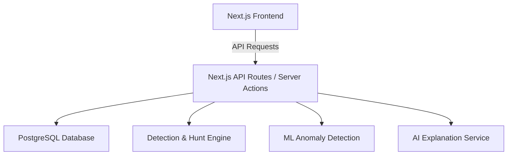
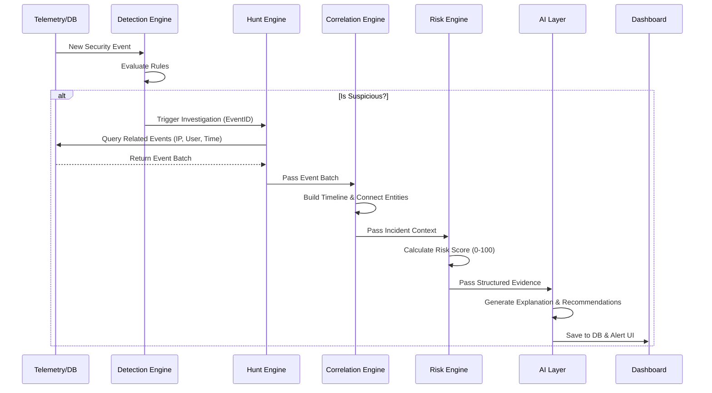

# Architecture

## 1. High-Level Architecture
The system follows a monolith structure with Next.js serving as both the frontend client and the API backend. A PostgreSQL database stores all state, configuration, and telemetry.

## 2. Frontend Architecture
Next.js App Router structure. UI components are modularized following a Neubrutalist design system.
- `/app`: Pages and layouts.
- `/components/ui`: Reusable primitives (CyberButton, StatusBadge).
- `/components/dashboard`: Command center modules.
- `/components/incidents`: Investigation views and timelines.

## 3. Backend Architecture
Business logic is encapsulated in a `/lib` directory, keeping API routes thin.
- `/lib/detection`: Rule evaluation.
- `/lib/hunting`: Related event retrieval.
- `/lib/correlation`: Timeline and incident building.
- `/lib/risk`: Scoring algorithms.
- `/lib/ai`: LLM provider abstraction.

## 4. Incident Lifecycle Flow

## 5. Security Boundaries
- The AI layer is strictly downstream of the data; it does not query the database directly. It only receives sanitized, structured JSON.
- API endpoints are protected against injection through Prisma parameterized queries.
- Environment variables securely hold LLM API keys and DB credentials.
