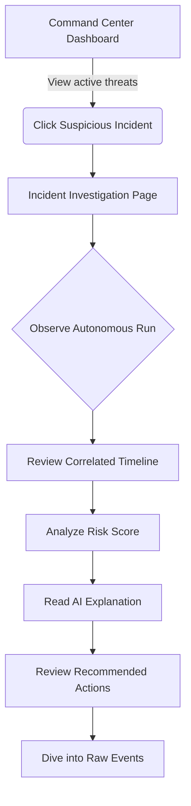

# User Flow

The application is designed to mimic a real SOC analyst workflow, moving from high-level alerts to deep forensic investigation.

## Primary Investigation Flow

## Detailed Views

1. **Dashboard (Command Center):**
   - User lands on the Command Center.
   - Observes the main threat activity timeline and high-severity incidents.
   - Sees the autonomous investigation queue processing incoming triggers.

2. **Incident Investigation:**
   - User opens an incident (e.g., "Possible Account Compromise").
   - The UI displays the triggering event and the status of the investigation.
   - User visually sees the investigation progress: `TRIGGER DETECTED` -> `COLLECTING EVIDENCE` -> `CORRELATING EVENTS` -> `ASSESSING RISK` -> `GENERATING ANALYSIS`.
   - Once complete, the timeline populates, the risk score is displayed (e.g., 87/100), and the AI analysis report appears.

3. **Threat Hunting (Manual):**
   - User selects an entity (User, IP) and time range.
   - Searches the event database.
   - Selects multiple events to manually construct or append to an incident.

4. **Event Explorer:**
   - User browses a dense, tabular view of raw telemetry.
   - Uses filters (time, severity, process).
   - Opens an event drawer to inspect JSON payload and metadata.

5. **System Rules & Runs:**
   - User views active detection rules.
   - User views logs of previous `InvestigationRun` executions, showing latency, entities examined, and outcomes.
